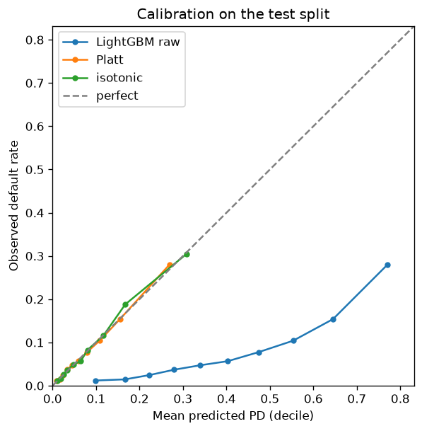
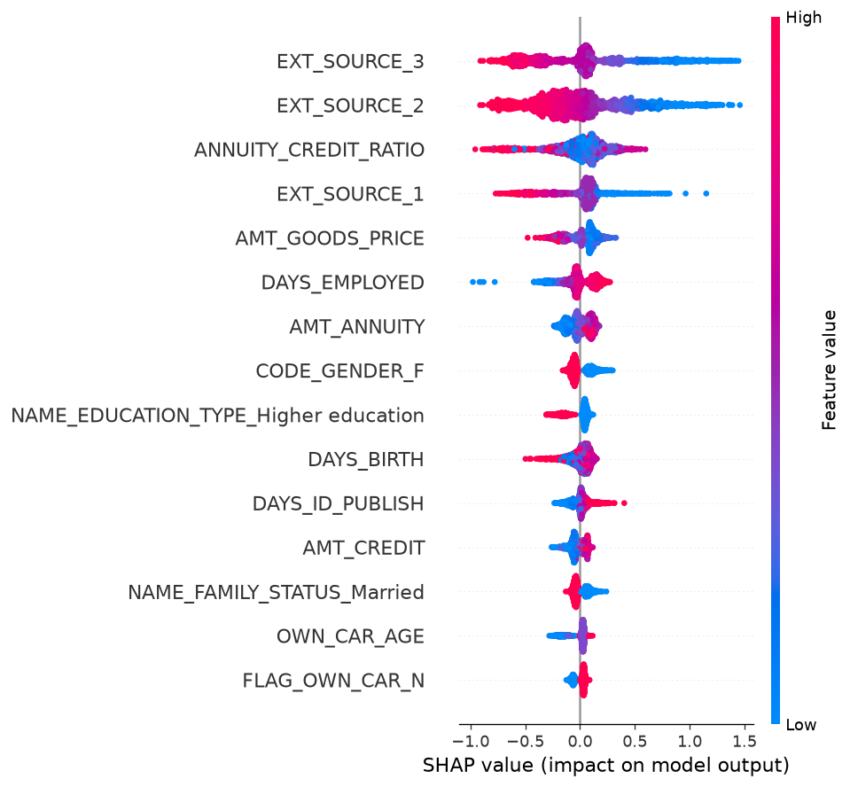

# Credit-Risk Scorecard

A credit default model on the public Home Credit Default Risk data: a logistic regression
baseline and a LightGBM model, trained on all 307,511 applications.

The part I care about is what happens after the model ranks people. I weighted the
classes to deal with the imbalance, and that broke the probabilities: the model said the
average applicant had a 39% chance of default when the real rate is 8%. This repo
measures that, fixes it with a calibration step fitted on held-out data, and shows what
the difference means for expected loss. It also checks how the decline decision falls
across gender and age groups.

> **Status:** Every number below comes from `python -m src.model` (about 3 minutes) and
> is written to [reports/results.md](reports/results.md). Running it twice gives
> identical numbers. The limitations section is worth reading before the results.

## Data

- **Source:** [Home Credit Default Risk](https://www.kaggle.com/competitions/home-credit-default-risk) (Kaggle).
- **Table used:** `application_train.csv`, 307,511 applications and 122 columns. `TARGET`
  = 1 means the client had payment difficulties. That's broader than a formal default,
  but I call it default below for short. 8.07% of applicants have it.
- **Not used yet:** the bureau and previous-application tables. See "What's not built".
- The raw CSVs aren't committed. Download steps are in [data/README.md](data/README.md).

## Method

1. **Split** 60% train / 20% calibration / 20% test, stratified on the target. The models
   only see train, the calibration step only sees calibration, and every number is on test.
2. **Features** (`src/features.py`): the `DAYS_EMPLOYED` value 365243, which means "not
   employed", becomes missing. Three ratios are added (credit/income, annuity/income,
   annuity/credit). Numbers get median imputation and standardisation, and categories get
   one-hot encoding. That's 247 columns.
3. **Models** (`src/model.py`): a class-weighted logistic regression, and LightGBM with
   `scale_pos_weight` (each defaulter counts about 11.4 times). Fixed settings, no tuning.
4. **Calibration** (`src/calibrate.py`): Platt scaling and isotonic regression, fitted on
   the calibration split.
5. **Evaluation** (`src/evaluate.py`): ROC-AUC, PR-AUC, 95% bootstrap intervals (1,000
   resamples of the test set), Brier score, expected calibration error.
6. **Decision view**: a threshold table, an operating point, an illustrative
   expected-loss check (`src/expected_loss.py`) and a group check (`src/fairness.py`).
7. **Explainability** (`src/explain.py`): SHAP values for LightGBM.

## Results

### Ranking

| Model | ROC-AUC | 95% interval | PR-AUC | 95% interval |
|---|---|---|---|---|
| Logistic regression | 0.755 | 0.748 to 0.761 | 0.229 | 0.219 to 0.240 |
| LightGBM | **0.770** | 0.764 to 0.777 | **0.256** | 0.244 to 0.268 |

Both models were scored on the same resampled test sets. The gap (LightGBM minus
logistic) is 0.012 to 0.019 for ROC-AUC and 0.020 to 0.032 for PR-AUC. Both intervals
exclude zero, so LightGBM ranks applicants better, by a small margin.

An earlier version of this README reported 0.736 and 0.734 from a 17,000-row sample. The
code that drew that sample was never in the repo, so those numbers couldn't be
reproduced. The full-data run above replaces them.

**Logistic regression convergence.** The old setup (features scaled but not centred,
saga solver) hit its 1,000-iteration cap. The new setup (centred, lbfgs) converges in
223 iterations. ROC-AUC is 0.755 to 0.756 in every run, so the non-convergence wasn't
costing anything in ranking. I also found that the old setup converges when the matrix is
float32, so I can't say the missing centring was the cause.
[reports/logreg_convergence.md](reports/logreg_convergence.md) has all three runs.

### Calibration: the fix

A bank uses the predicted probability of default (PD) itself for provisions and
pricing. So the PD has to mean what it says, whatever the ranking looks like.

| LightGBM PDs on test | Mean PD | Brier score | ECE | ROC-AUC |
|---|---|---|---|---|
| Raw (class-weighted) | 0.394 | 0.1846 | 0.3134 | 0.770 |
| Platt scaling | 0.080 | 0.0672 | 0.0026 | 0.770 |
| Isotonic regression | 0.080 | 0.0672 | 0.0033 | 0.770 |

The observed default rate on test is 8.07%. The Brier score is the mean squared gap
between the PD and the 0/1 outcome. ECE (expected calibration error) sorts applicants
into 10 equal-sized groups by PD and averages the gap between predicted and actual
default rates. Calibration cuts the Brier score by 64% and the ECE by about 99%, and the
ranking stays the same.



The two methods come out the same here. I chose isotonic before looking at test results
because the calibration split is large (61,502 rows). It is used for everything below.

### Operating point

| Raw-score threshold | Precision | Recall | Share declined |
|---|---|---|---|
| 0.30 | 0.119 | 0.898 | 0.610 |
| 0.40 | 0.143 | 0.803 | 0.453 |
| 0.50 | 0.176 | 0.687 | 0.316 |
| 0.60 | 0.220 | 0.536 | 0.197 |
| 0.70 | 0.279 | 0.339 | 0.098 |

The illustrative policy is to decline the riskiest 20% of applicants. The threshold for
that (0.599) is set on the calibration split, not on test. On test it declines 19.7% of
applicants and catches 53.7% of the people who later had payment difficulties. 22.0% of
those declined did.

### Expected loss at that threshold (illustrative)

Expected loss = PD × LGD × exposure. The data has no recovery amounts, so LGD (loss given
default) is an assumed 45% and exposure is the full credit amount. Both are
**assumptions, not estimates**.

| Summed over approved applicants | Loss |
|---|---|
| Using raw PDs | 4,282,691,241 |
| Using calibrated PDs | 636,702,144 |
| Implied by what actually happened | 621,087,631 |

With the raw PDs, the expected loss comes out almost 7 times what the outcomes imply.
With calibrated PDs it comes within 3%. That gap is what "the class weighting broke the
probabilities" costs, if anyone used the raw scores for provisioning.

### Group check

At the same threshold, on test:

| Group | n | Actual default rate | Mean calibrated PD | Approval rate | Defaulters caught (TPR) | Good customers declined (FPR) |
|---|---|---|---|---|---|---|
| Women | 40,345 | 0.070 | 0.070 | 0.845 | 0.475 | 0.131 |
| Men | 21,158 | 0.102 | 0.099 | 0.723 | 0.617 | 0.239 |
| Age 20-29 | 8,975 | 0.115 | 0.116 | 0.646 | 0.675 | 0.312 |
| Age 30-44 | 24,664 | 0.090 | 0.088 | 0.774 | 0.581 | 0.191 |
| Age 45-59 | 20,778 | 0.066 | 0.066 | 0.858 | 0.437 | 0.120 |
| Age 60+ | 7,086 | 0.048 | 0.047 | 0.941 | 0.238 | 0.050 |

What it shows: calibrated PDs match actual default rates within each group, so the
model isn't systematically over- or under-stating risk for any of them. But men with
no payment difficulties are declined at almost twice the rate of women with none (23.9%
vs 13.1%). Under-30s without difficulties are declined at 31.2%, against 5.0% for over-60s.

What it doesn't show: why. Part of the gap tracks real differences in default rates. But
`CODE_GENDER` is a model input and is the 8th most important feature by SHAP, and age
enters directly through `DAYS_BIRTH`. Canadian human rights law bars discrimination on
sex in services, credit included, so a real model couldn't use this input as it is. Dropping the column wouldn't settle the question either, because other features can
stand in for it. This check is a starting point, not a legal or fairness assessment.

### What the model relies on

The top features by mean absolute SHAP value (2,000 test rows) are the three external
credit scores (`EXT_SOURCE_3`, `EXT_SOURCE_2`, `EXT_SOURCE_1`), then
`ANNUITY_CREDIT_RATIO` (one of the ratios I added), goods price, employment length and
annuity. The full list is in [reports/results.md](reports/results.md).



## What's not built

- **SQL features.** `src/data_load.py` loads the CSVs into PostgreSQL and
  `python -m src.model --from-db` can train from there. But `sql/features.sql` holds only
  one commented example, and the bureau and previous-application tables aren't used.
  Earlier versions of this README said there was a SQL feature pipeline. There isn't yet.
- **Missing-value flags.** Missing values are imputed. Flags for "this field was
  missing" would likely help, since missingness in credit data often carries signal.
- **Tuning.** LightGBM runs with fixed settings.

## Limitations

- The split is random, not by time, so drift over time is untested.
- The target is "payment difficulties", not a formal default definition.
- The expected-loss view rests on an assumed LGD and exposure.
- The group check covers two attributes with coarse groups, and gender is used as an input.
- Home Credit's applicants aren't a Canadian bank's book.

The model shouldn't be used for pricing, collections or any real lending decision. More
in [MODEL_CARD.md](MODEL_CARD.md) and [reports/model_risk_writeup.md](reports/model_risk_writeup.md).

## Reproduce

```bash
python -m venv .venv && source .venv/bin/activate   # Windows: .venv\Scripts\activate
pip install -r requirements.txt
# put application_train.csv in data/ (see data/README.md)
python -m src.model            # everything in this README; about 3 minutes
python -m src.logreg_check     # the convergence comparison; slower (saga)
streamlit run app/streamlit_app.py
```

Optional PostgreSQL: copy `.env.example` to `.env`, fill in credentials, run
`python -m src.data_load`, then `python -m src.model --from-db`.

Tests (`pytest`) and linting (`ruff`) run in GitHub Actions on every push. The tests use
synthetic applicants, so they don't need the Kaggle data: `pip install -r requirements-dev.txt && pytest`.

## Repo structure

```
credit-risk-scorecard/
├── README.md
├── MODEL_CARD.md
├── requirements.txt / requirements-dev.txt
├── data/README.md            # download steps; raw data is not committed
├── sql/features.sql          # placeholder, see "What's not built"
├── src/
│   ├── model.py              # split, train, calibrate, evaluate, write reports
│   ├── features.py
│   ├── calibrate.py
│   ├── evaluate.py
│   ├── expected_loss.py
│   ├── fairness.py
│   ├── explain.py
│   ├── logreg_check.py
│   ├── data_load.py
│   └── config.py
├── tests/
├── notebooks/01_eda.ipynb
├── app/streamlit_app.py
├── docs/archive/SPRINT1.md   # early working notes
└── reports/
    ├── results.md            # generated
    ├── metrics.json          # generated
    ├── logreg_convergence.md # generated
    ├── model_risk_writeup.md
    └── figures/
```
