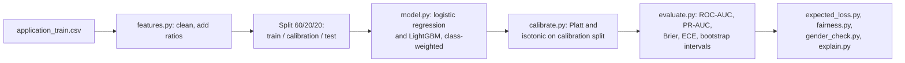

# Credit-risk scorecard

A LightGBM model that ranks loan applicants by default risk and turns that score into
a probability a lender can use, tested on 307,511 real applications from Kaggle's Home
Credit data.

## In plain words

This project scores loan applicants for the risk that they miss payments. The first
version of the score was much too high for everyone: it said the average applicant had
a 40% chance of missing payments, when the real rate is 8%. This project fixes that
with a second step, and also checks whether declines fall unevenly across gender and
age.

## Try it

```bash
make setup   # installs the pinned packages with uv
make demo    # runs the real pipeline on synthetic applicants, no download needed
make all     # setup, lint, test, the real evaluation, demo, and the doc checks
```

`make all` needs Kaggle's data (see [data/README.md](data/README.md)); `make demo`
does not. To see the decision view, run `make eval` once, then
`uv run streamlit run app/streamlit_app.py`.

## Result

LightGBM's [ROC-AUC](docs/glossary.md#roc-auc) on held-out test data is 0.769 (95%
[confidence interval](docs/glossary.md#confidence-interval) 0.762 to 0.775). The
[baseline](docs/glossary.md#baseline) logistic regression scores 0.752 (0.745 to
0.759), so LightGBM ranks applicants better, but only by a small margin. Every number
below comes from `python -m credit_risk_scorecard.model` (about 3 minutes), which
writes [reports/results.md](reports/results.md). Running it twice gives identical
numbers.


The chart shows the raw score badly overstating risk, and the isotonic-calibrated PD
tracking the true default rate. This is the main fix in this project: the ranking was
already fine, but the probabilities were not.

### Ranking

| Model | ROC-AUC | 95% interval | [PR-AUC](docs/glossary.md#pr-auc) | 95% interval |
|---|---|---|---|---|
| Logistic regression | 0.752 | 0.745 to 0.759 | 0.227 | 0.216 to 0.238 |
| LightGBM | 0.769 | 0.762 to 0.775 | 0.254 | 0.242 to 0.265 |

Both models were scored on the same resampled test sets. The gap (LightGBM minus
logistic) is 0.013 to 0.020 of [ROC-AUC](docs/glossary.md#roc-auc) and 0.021 to 0.033 of
[PR-AUC](docs/glossary.md#pr-auc). Both intervals exclude zero, so LightGBM ranks
applicants better, by a small margin.

With `CODE_GENDER` as an input, LightGBM's ROC-AUC was 0.770, against 0.769 without it
([reports/gender_check.json](reports/gender_check.json)). An earlier version of this
README reported 0.736 and 0.734 from a 17,000-row sample. <!-- not-a-claim -->
The code that drew that sample was never committed, so those numbers can't be checked
again.

### Convergence of the logistic regression

The first setup (features scaled but not centred, `saga` solver) hit its 1,000-
iteration cap. The current one (centred, `lbfgs`) converges in 227 iterations.
ROC-AUC is between 0.752 and 0.753 in all three runs in
[reports/logreg_convergence.md](reports/logreg_convergence.md), so the non-convergence
wasn't costing anything in ranking. The old setup also converges, in 149 iterations,
when the matrix is float32, so I can't say the missing centring was the cause.

### Calibration

A bank uses the predicted probability of default (PD) itself for provisions and
pricing, so the PD has to mean what it says. [Calibration](docs/glossary.md#calibration)
is the step that makes that true.

| LightGBM PDs on test | Mean PD | [Brier score](docs/glossary.md#brier-score) | [ECE](docs/glossary.md#ece) | ROC-AUC |
|---|---|---|---|---|
| Raw (class-weighted) | 0.395 | 0.1851 | 0.3145 | 0.769 |
| [Platt scaling](docs/glossary.md#platt-scaling) | 0.080 | 0.0673 | 0.0032 | 0.769 |
| [Isotonic regression](docs/glossary.md#isotonic-regression) | 0.080 | 0.0673 | 0.0027 | 0.768 |

The observed default rate on test is 8.07%. The Brier score is the mean squared gap
between the PD and the 0/1 outcome. ECE sorts applicants into 10 equal-sized groups by
PD and averages the gap between predicted and actual default rates. Calibration cuts
the Brier score by 64% and the ECE by 99%, and the ranking barely changes. <!-- not-a-claim -->

Platt and isotonic come out the same here. I chose isotonic before looking at test
results, because the calibration split is large (61,502 rows), and it is used for
everything below.

### Operating point

| Raw-score threshold | Precision | Recall | Share declined |
|---|---|---|---|
| 0.30 | 0.118 | 0.897 | 0.614 |
| 0.40 | 0.142 | 0.800 | 0.455 |
| 0.50 | 0.175 | 0.685 | 0.316 |
| 0.60 | 0.220 | 0.532 | 0.196 |
| 0.70 | 0.281 | 0.341 | 0.098 |

The illustrative policy is the [decline rate](docs/glossary.md#decline-rate): decline
the riskiest 20% of applicants. The threshold for that (0.600) is set on the
calibration split, not on test. On test it declines 19.5% of applicants and catches
53.2% of the people who later had payment difficulties. 22.0% of those declined did.

### Expected loss at that threshold (illustrative)

[Expected loss](docs/glossary.md#expected-loss) = PD x [LGD](docs/glossary.md#lgd) x
exposure. The data has no recovery amounts, so LGD (loss given default) is set to 45%
and exposure to the full credit amount. Both are assumed values; neither is estimated
from the data.

| Summed over approved applicants | Loss |
|---|---|
| Using raw PDs | 4,312,985,709 |
| Using calibrated PDs | 642,168,648 |
| Implied by what actually happened | 633,364,511 |

With the raw PDs, the expected loss is almost 7 times what the outcomes imply. With
calibrated PDs it is within 2%. That is what the broken probabilities would cost if
anyone used the raw scores for provisioning.

### Gender

`CODE_GENDER` used to be a model input, and it was the 8th most important feature by
[SHAP](docs/glossary.md#shap). It is now left out of the model and kept in the data
only for this check. `python -m credit_risk_scorecard.gender_check` trains the model
with and without it on the same split and compares the decisions at each model's own
20% decline threshold ([reports/gender_check.md](reports/gender_check.md)).

| Model | ROC-AUC | Group | Approval rate | Defaulters declined (recall) | Non-defaulters declined (false-positive rate) |
|---|---|---|---|---|---|
| With gender | 0.770 | Women | 0.845 | 0.475 | 0.131 |
| With gender | 0.770 | Men | 0.723 | 0.617 | 0.239 |
| Without gender | 0.769 | Women | 0.832 | 0.492 | 0.144 |
| Without gender | 0.769 | Men | 0.752 | 0.583 | 0.209 |

Dropping the column cost 0.002 of ROC-AUC (0.7703 to 0.7687) and narrowed the gaps. <!-- not-a-claim -->
Men were approved 12.2 points less often than women; now it is 7.9 points. <!-- not-a-claim -->
Among applicants who had no payment difficulties, men were declined 10.8 points more <!-- not-a-claim -->
often than women; now it is 6.6. <!-- not-a-claim -->

A gap remains, and part of it comes through other inputs. From the model's remaining
inputs, a logistic regression can tell men from women with ROC-AUC 0.876. Three inputs
are among the model's 20 most important and also correlated with gender:
`EXT_SOURCE_1` (SHAP rank 3, correlation with being male -0.20), `DAYS_BIRTH` (rank 9,
+0.15, as men in this data are younger) and `FLAG_OWN_CAR` (rank 20, +0.34 for owning a
car). Men also had payment difficulties more often in this data (10.2% against 7.0%),
so some gap would show up even if the model knew nothing about gender. This check can't
separate the two.

Dropping the column also shifted calibration by group. Calibrated PDs are now above
the observed rate for women (7.4% predicted, 7.0% observed) and below it for men (9.2%
and 10.2%). With the column, both were within 0.3 points.

### Age

At the same threshold, without gender:

| Age | Applicants | Observed default rate | Mean calibrated PD | Approval rate | Recall | False-positive rate |
|---|---|---|---|---|---|---|
| 20-29 <!-- not-a-claim --> | 8,975 | 0.115 | 0.116 | 0.650 | 0.679 | 0.307 |
| 30-44 <!-- not-a-claim --> | 24,664 | 0.090 | 0.088 | 0.774 | 0.578 | 0.191 |
| 45-59 <!-- not-a-claim --> | 20,778 | 0.066 | 0.066 | 0.860 | 0.429 | 0.120 |
| 60+ | 7,086 | 0.048 | 0.047 | 0.946 | 0.202 | 0.047 |

Age enters the model directly through `DAYS_BIRTH`. Applicants aged 20 to 29 <!-- not-a-claim -->
who had no payment difficulties are declined 30.7% of the time, against 4.7% for those
over 60.
Calibration holds within every age band. Age is also a prohibited ground of
discrimination under the Canadian Human Rights Act. I've left `DAYS_BIRTH` in and
reported its effect; whether a lender could use it is a legal question this repo
doesn't answer.

### What the model relies on

The top features by mean absolute SHAP value (2,000 test rows) are the three external
credit scores (`EXT_SOURCE_3`, `EXT_SOURCE_2`, `EXT_SOURCE_1`), then
`ANNUITY_CREDIT_RATIO` (one of three ratios added in [features.py](src/credit_risk_scorecard/features.py)),
goods price, employment length and annuity. The full list is in
[reports/results.md](reports/results.md).


The chart ranks each input by how much it moves a typical prediction, on average,
across 2,000 test applicants.

## How I worked

- Evaluation plan, written after the results, because the results already existed when
  I adopted the house standard: [docs/eval_plan.md](docs/eval_plan.md) (commit
  `4e4fe87`). It says so plainly, and names the commit behind each choice.
- Decision records: [docs/decisions/](docs/decisions/), one per past modelling choice
  I could reconstruct from the git history.
- Error analysis: the gender and age group checks above, and
  [reports/gender_check.md](reports/gender_check.md), which trains the model with and
  without `CODE_GENDER` to see what changes.
- Full list of weaknesses, ranked by how much each could change the result:
  [docs/whats_weak.md](docs/whats_weak.md).
- Self-score against Google's ML Test Score: [docs/ml_test_score.md](docs/ml_test_score.md).

## How it works



The data is cleaned and three ratios are added (credit-to-income, annuity-to-income,
annuity-to-credit), then split into train, calibration and test parts, stratified on
the target. Logistic regression and LightGBM both train on the train part with class
weighting, since only 8.07% of applicants have the target. Platt scaling and isotonic
regression are fitted on the calibration part to turn LightGBM's raw score into a
probability. Every reported metric, the decline threshold, the expected-loss view and
the SHAP explanations are computed on the test part. `CODE_GENDER` never reaches the
model; it is kept only to check the decisions afterward.

## What's weak

The three weaknesses most likely to change the headline result, from
[docs/whats_weak.md](docs/whats_weak.md):

1. The split is random, not by time. The data has no application date, so a model that
   looked good today could look different on tomorrow's applicants, and this repo can't
   measure that.
2. The [baseline](docs/glossary.md#baseline) is a plain logistic regression, not a
   scorecard with binned inputs, which is what banks use. Neither model is tuned, so the
   gap between them could move either way with more work.
3. Only the application table is used. The bureau and previous-application tables
   aren't, and adding them would likely change every number, in a direction this repo
   hasn't measured.

Also worth knowing: there are no SQL features built yet (`sql/features.sql` holds one
commented example, and the bureau and previous-application tables aren't used), and
missing values are imputed without a flag saying they were missing, which credit data
often needs. The full ranked list of 14 weaknesses, including the smaller ones, is in <!-- not-a-claim -->
[docs/whats_weak.md](docs/whats_weak.md). The model shouldn't be used for pricing,
collections or any real lending decision; see [MODEL_CARD.md](MODEL_CARD.md) and
[reports/model_risk_writeup.md](reports/model_risk_writeup.md).

## Docs

- Tutorial: [docs/tutorial.md](docs/tutorial.md), a first run from a fresh clone.
- How-to guides: [docs/how-to/](docs/how-to/), for a specific task such as running the
  checks or reproducing the full evaluation.
- Reference: [docs/reference.md](docs/reference.md), the make targets, scripts and
  files, looked up rather than read start to end.
- Explanation: [docs/explanation.md](docs/explanation.md), the reasoning behind the
  pipeline's design.
- Glossary: [docs/glossary.md](docs/glossary.md), one plain sentence per technical
  term used across these docs.

## Repo map

<!-- repo-map:start -->
| Path | What it holds |
|---|---|
| `.github/` | CI workflows and GitHub settings |
| `app/` | The Streamlit demo app; needs `models/pipeline.joblib` from `make eval` |
| `CLAIMS.md` | Every number in the docs, with its source file and command |
| `data/` | Download steps for the Kaggle data; the raw CSV is not committed |
| `docs/` | Evaluation plan, decisions, glossary and the four kinds of docs |
| `Makefile` | One command for each step: setup, lint, test, eval, demo |
| `models/` | Trained pipeline (`pipeline.joblib`), not committed; `make eval` rebuilds it |
| `notebooks/` | Exploration notebooks (not used to make the reported numbers) |
| `reports/` | Generated results, including metrics.json |
| `sql/` | A placeholder feature query; see "What's weak" |
| `src/` | The package code |
| `tests/` | Unit and data tests |
| `tools/` | Checks for claims, readability, AI-writing signs and links |
<!-- repo-map:end -->
